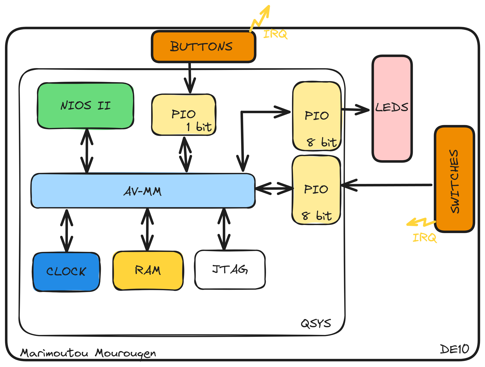

# marimoutou_lab1

## Introduction
Au travers de ce cours nous allons mettre en pratique les notions de conception conjointe vu en cours, nous travaillerons avec une carte DE10-Lite qui possédent un FPGA MAX10 10M50DAF484C7G de la gamme Altera.  
Pour ce premier lab on se propose de réaliser un chenillard de leds qui sera actionnée par une interruptions et dont on pourra modifier la vitesse. Cela nous permettra de nous familiariser avec le flow de conception.

## Architecture du sytème

Le système est composé de l'architecture basique vu en cours dans laquelle on retrouve:
* Un processeur Nios II
* Une mémoire RAM
* Une clock
* Un port JTAG

A cela on ajoute :
 * Un PIO 8 bits pour les leds
 * Un PIO 8 bits pour les switches
 * Un PIO 1 bits pour le bouton (KEY1)

 L'architecture sous Platform Designer (QSYS) est donc la suivante :

## Travail effectué

## Conclusion
